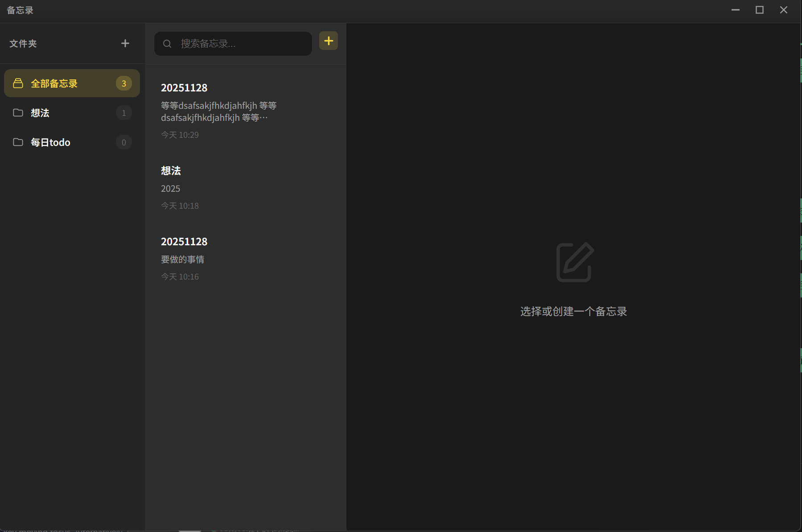

# Windows Memo / Windows 备忘录

[English](#english) | [中文](#中文)

---

<a name="english"></a>
## English

A Mac-style Notes app for Windows, built with Electron.

### Screenshot



### Background

As a frequent user of Mac's Notes app, I've grown to love its clean design and intuitive interface. However, when switching to Windows, I couldn't find a similar experience. So I decided to build one myself — and that's how this project was born.

### Features

- 📝 Create, edit, and delete notes
- 📁 Organize notes with folders
- 🔍 Quick search
- 💾 Auto-save
- 🎨 Modern dark theme UI

### Installation

```bash
# Install dependencies
npm install

# Run the app
npm start
```

### Build

```bash
# Build Windows installer
npm run build
```

### Tech Stack

- Electron
- HTML5 / CSS3 / JavaScript
- Local JSON file storage

### Keyboard Shortcuts

- `Esc` - Close dialogs

### Data Storage

Notes are saved in the user data directory:
`%APPDATA%/windows-memo/notes.json`

---

<a name="中文"></a>
## 中文

一款 Mac 风格的 Windows 备忘录应用，使用 Electron 构建。

### 应用截图


### 项目背景

作为一个 Mac 备忘录的重度用户，我非常喜欢它简洁的设计和直观的界面。然而当切换到 Windows 时，我找不到类似的体验。于是我决定自己动手做一个——这个项目就这样诞生了。

### 功能特性

- 📝 创建、编辑、删除备忘录
- 📁 文件夹分类管理
- 🔍 快速搜索
- 💾 自动保存
- 🎨 现代化深色主题界面

### 安装与运行

```bash
# 安装依赖
npm install

# 运行应用
npm start
```

### 打包发布

```bash
# 构建 Windows 安装包
npm run build
```

### 技术栈

- Electron
- HTML5 / CSS3 / JavaScript
- 本地 JSON 文件存储

### 快捷键

- `Esc` - 关闭弹窗

### 数据存储

备忘录数据保存在用户数据目录：
`%APPDATA%/windows-memo/notes.json`
